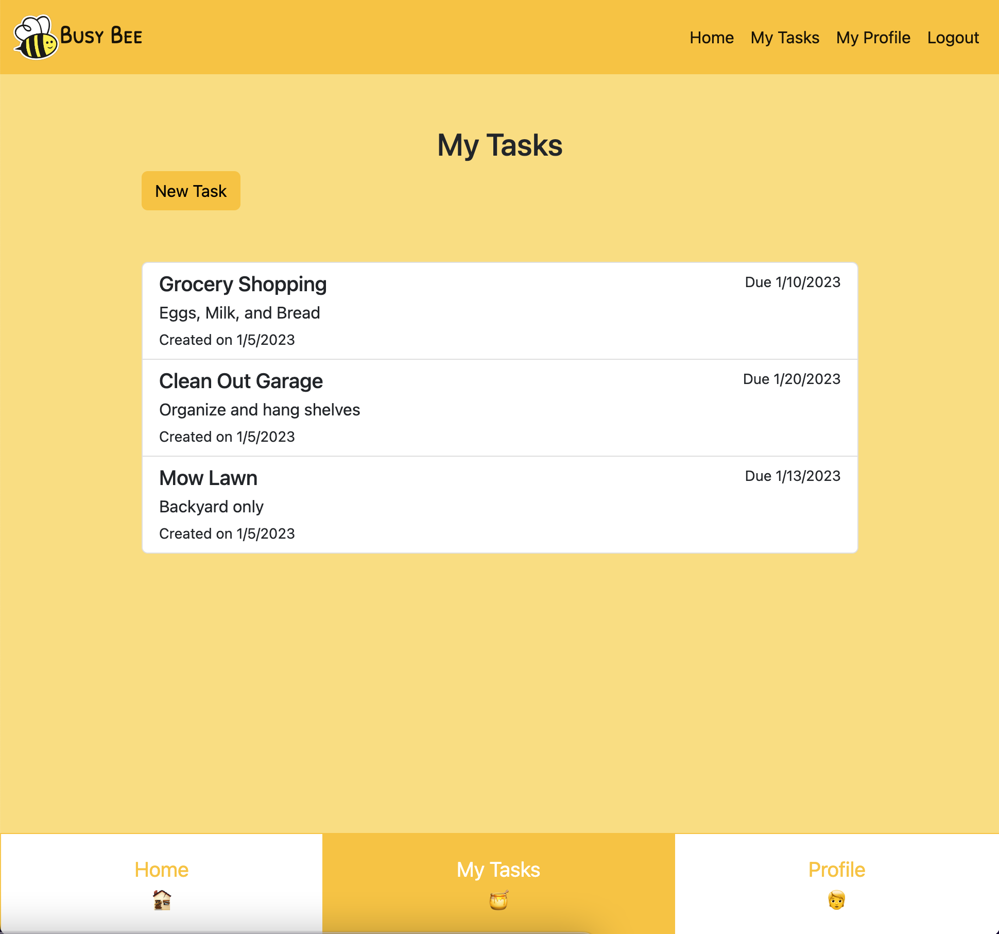

# Busy Bee
  [](https://opensource.org/licenses/MIT)
  ## Description
  Busy Bee is a task manager web application that allows users to create a profile and create, edit, and complete tasks. Tasks can be assigned subtasks and assigned due dates. You can earn points by completing tasks which earn you badges for your profile.

  Technologies Used: CSS, JavaScript, HTML, Bootstrap, Node JS, Axios, Express, Handlebars, MySQL, Heroku, Sequelize

  New Technology Used: Axios

  Application is deployed here: https://lit-beach-45684.herokuapp.com/
  
---

  ## Preview
  

---

  ## Table of Contents
  1. [Description](#description)
  2. [Installation](#installation)
  3. [Usage](#usage)
  4. [License](#license)
  5. [Contributing](#contributing)
  6. [Questions](#email)

---

  ## Installation
  To install the needed dependencies, run the following commands: 
  ```
  npm i
  ```

---

  ## Usage
  Feel free to make an account on the site and start using it! Everything is free to use! You can use this project by accessing it at the deployed link: https://lit-beach-45684.herokuapp.com/

---

  ## License
  This project is licensed under the [MIT](https://choosealicense.com/licenses/mit/) license. 

---

  ## Contributing
  You can contribute to this project by either opening issues on the github repo or by emailing me directly at my contact info at the bottom of this readme.

  **Credits: Jennifer Blacutt, Charnee Francis, Carter Matschek, and  Justin Watkins**

---

  ## Questions
  Feel free to open an issue on the repo or contact us individually at:
  * https://github.com/itsjennyb
  * https://github.com/cffrancis
  * https://github.com/cartermatschek
  * https://github.com/JWatkins28

  Repo: https://github.com/JWatkins28/busy-bee

  
